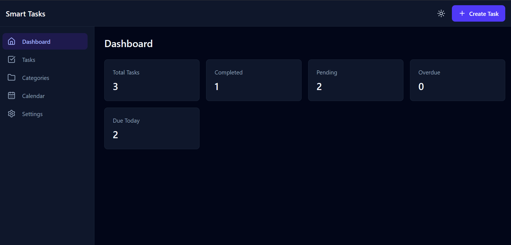
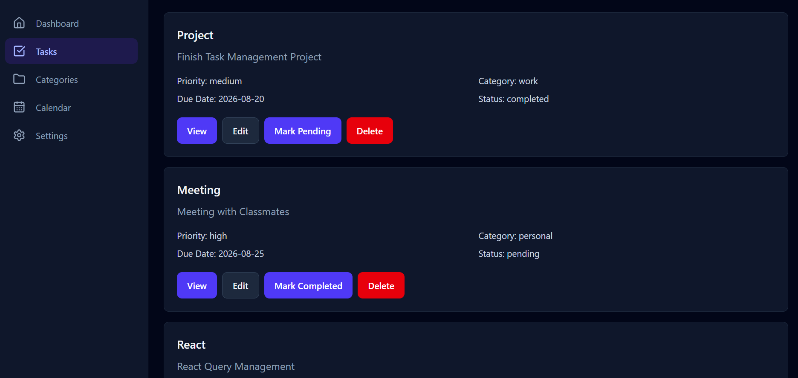
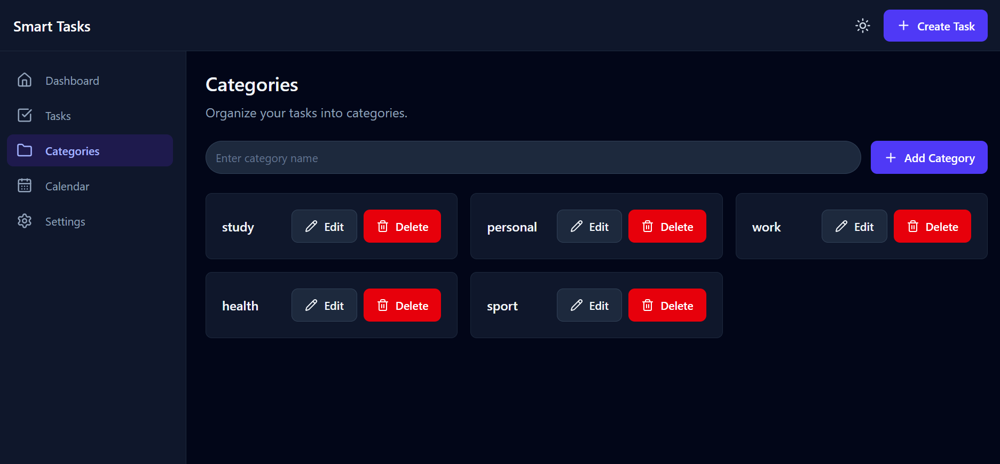
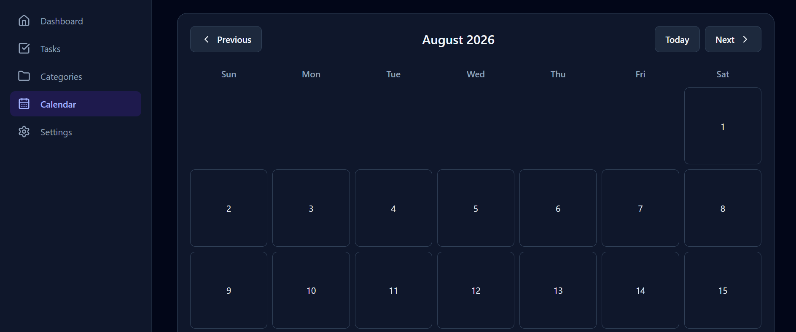
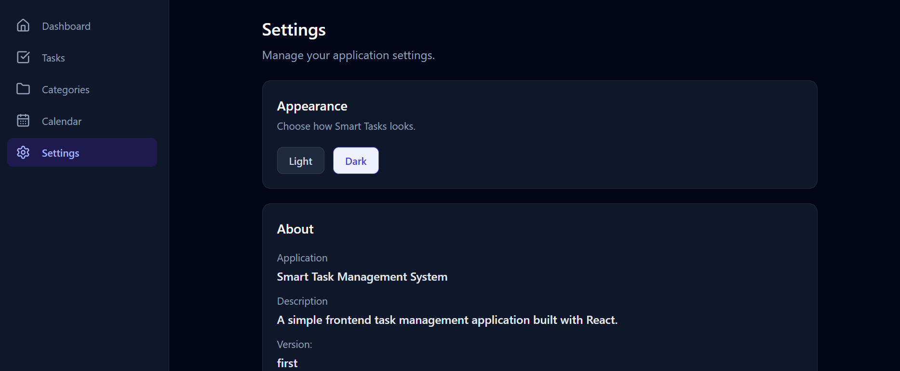

# Smart Task Management System

A simple task management website built with React.

I built this project as a React practice project to improve my skills with
components, Context API, custom hooks, forms, routing, and local storage.

## Features

- Create, edit, and delete tasks
- View task details
- Mark tasks as completed or pending
- Search tasks
- Filter by status, priority, category, and due date
- Combine multiple filters
- Manage categories
- Monthly calendar
- View tasks by date
- Dark and light mode
- Data saved in Local Storage
- Responsive design for mobile, tablet, and desktop

## Screenshots

### Dashboard



### Tasks



### Categories



### Calendar



### Settings



## Built With

- React
- React Router DOM
- Context API
- Tailwind CSS
- React Hook Form
- Zod
- Local Storage
- Lucide React

## Main Pages

### Dashboard

Shows a quick overview of the tasks:

- Total tasks
- Completed tasks
- Pending tasks
- Overdue tasks
- Tasks due today

### Tasks

The main task management page.

Users can create, edit, delete, search, filter, and view tasks.

### Categories

Categories can be added, edited, and deleted to help organize tasks.

### Calendar

A monthly calendar where tasks can be viewed based on their due dates.

### Settings

Contains application settings including the theme preference.

## Project Structure

```text
src/
├── components/
├── contexts/
├── hooks/
├── pages/
├── routes/
└── utils/
```
